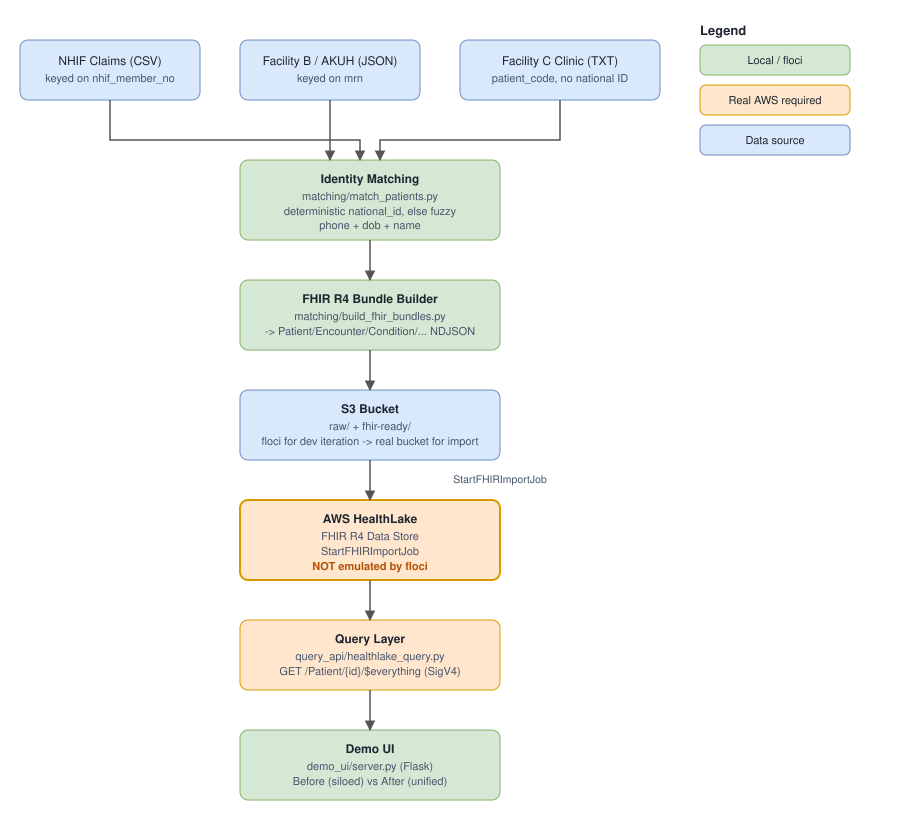

# Portable Medical History via AWS HealthLake

[](https://github.com/keanehatescoding/health-fhir-interop/actions/workflows/validate-bundles.yml)

Hackathon prototype: patients in Kenya lack a portable medical history — NHIF
(the national insurer) and each private facility keep siloed records under
their own patient identifiers, so a patient's history doesn't follow them
between providers. This project uses **AWS HealthLake** (a managed FHIR R4
data store) as a neutral interoperability layer, with an identity-matching
step that links a person's NHIF, MRN, and national-ID records into one
canonical FHIR `Patient`.

Local development runs against **[floci](https://floci.io/)**, a free
open-source local AWS emulator — everything that can run locally does;
HealthLake itself always requires a real AWS account (it's not emulated
anywhere locally, floci included).

## Architecture



Editable source: [`docs/architecture.drawio`](docs/architecture.drawio)
(open in [diagrams.net](https://app.diagrams.net/) or the VS Code Draw.io
Integration extension).

## Quick start

See [`DEMO.md`](DEMO.md) for the full runbook (setup, local pipeline, floci,
real AWS, and the live demo flow).

```bash
python3 -m venv .venv && source .venv/bin/activate
pip install -r requirements.txt
cp .env.example .env

python data_gen/generate_synthetic_data.py
python -m matching.match_patients
python -m matching.build_fhir_bundles
python -m matching.validate_bundles

python -m demo_ui.server   # http://localhost:5000
```

## Repo layout

| Path | Purpose |
|---|---|
| `data_gen/` | Synthetic NHIF + private-facility data (deliberately fragmented) |
| `matching/` | Identity resolution + FHIR R4 bundle building/validation |
| `infra/` | S3 upload, HealthLake data store/import (real AWS) |
| `query_api/` | FHIR query layer — mock (local NDJSON) or real HealthLake |
| `demo_ui/` | Flask app showing "before" (siloed) vs "after" (unified) |
| `common/` | Shared floci/real-AWS client switch |
| `docs/` | Architecture diagram |
